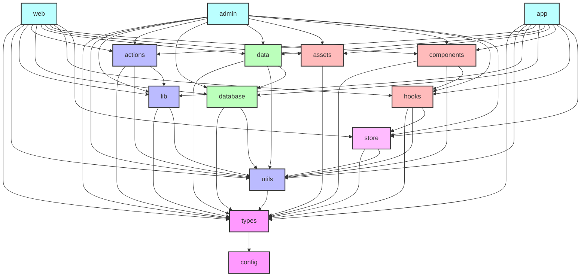

# Saedgewell

- ポートフォリオサイト(@saedgewell/web)
- 管理画面/業務アプリ(@saedgewell/admin)
- クライアント(@saedgewell/app)
を統合したプロジェクト

## 技術スタック

### フレームワーク・ライブラリ
- Next.js (App Router)
- Bun
- TypeScript

### UI
- shadcn/ui
- MagicUI
- Tailwind CSS

### バックエンド
- Supabase (データベース)
- Supabase Auth (認証)

### 状態管理
- Jotai

### ビルドツール
- tsup (パッケージビルド)
- Turbopack (Next.jsアプリケーション)

### Linter
- Biome

### デプロイ
- Vercel

## プロジェクト構成

```
.
├── apps/
│   ├── portfolio/        # ポートフォリオサイト
│   └── admin/           # 管理者用アプリ
│   └── app/             # クライアント用アプリ
└── packages/
    ├── actions/         # サーバーアクション
    ├── assets/         # 共通アセット
    ├── components/    # UIコンポーネント
    │   ├── core/     # 基本コンポーネント
    │   ├── features/      # 機能コンポーネント
    │   └── /animation     # アニメーションコンポーネント
    ├── config/         # 設定ファイル
    │   ├── biome/     # Biome設定
    │   ├── tsup/      # tsup設定
    │   └── turbo/     # Turborepo設定
    ├── data/         # あまり変更しないデータとか
    ├── database/      # データベース関連
    ├── hooks/           # カスタムフック
    ├── lib/            # 外部クライアント
    │   ├── server/     # サーバー
    │   ├── client/      # クライアント
    │   └── shared/     # 共通
    ├── store/           # Jotaiストア
    ├── types/           # 型定義（Supabase自動生成の型を含む）
    └── utils/           # その他のユーティリティ
```

## パッケージ依存関係図



## Server/Client Components分類

### Server Components
- packages/actions/
- packages/database/
- packages/auth/

### Client Components
- packages/ui/
- packages/store/
- packages/hooks/

### 両方で使用可能
- packages/types/
- packages/lib/
- packages/config/

## 開発コマンド

```bash
# 開発サーバー起動
bun run dev

# パッケージビルド
bun run build

# Supabase型定義の生成と同期
bun run types:sync

# クリーンアップ
bun run clean
```

## 環境変数

```env
NEXT_PUBLIC_SUPABASE_URL=your_supabase_url
NEXT_PUBLIC_SUPABASE_ANON_KEY=your_supabase_anon_key
SUPABASE_SERVICE_ROLE_KEY=your_service_role_key
SUPABASE_PROJECT_ID=your_project_id
```

## パッケージの依存関係

### 基盤パッケージ ✅
- `@saedgewell/config`: すべてのパッケージの共通設定を提供 ✅
  - TypeScript設定
  - Biome設定
  - tsup設定
  - その他の共通設定
- `@saedgewell/types`: すべてのパッケージの型定義を提供 ✅
  - 依存: `@saedgewell/config`
  - Supabaseの型定義
  - 共通インターフェース
  - ユーティリティ型

### ユーティリティパッケージ
- `@saedgewell/utils`: 共通ユーティリティ関数 ✅
  - 依存: `@saedgewell/types`
- `@saedgewell/lib`: 外部クライアントと共通ライブラリ ✅
  - 依存: `@saedgewell/types`, `@saedgewell/utils`
- `@saedgewell/actions`: サーバーアクション　✅
  - 依存: `@saedgewell/types`, `@saedgewell/utils`, `@saedgewell/lib/server`

### データ関連パッケージ
- `@saedgewell/database`: データベース関連の設定と型 *現時点では未使用* ✅
  - 依存: `@saedgewell/types`, `@saedgewell/utils`
- `@saedgewell/data`: サンプルデータなど ✅
  - 依存: `@saedgewell/types`, `@saedgewell/utils`, `@saedgewell/database`

### 状態管理パッケージ
- `@saedgewell/store`: Jotaiを使用した状態管理
  - 依存: `@saedgewell/types`, `@saedgewell/utils`

### UI関連パッケージ
- `@saedgewell/assets`: 画像やフォントなどの静的アセット　✅
  - 依存: `@saedgewell/types`
- `@saedgewell/hooks`: 共通Reactフック ✅
  - 依存: `@saedgewell/types`, `@saedgewell/utils`, `@saedgewell/store`
- `@saedgewell/components`: 共通UIコンポーネント ✅
  - 依存: `@saedgewell/types`, `@saedgewell/utils`, `@saedgewell/hooks`


### アプリケーションパッケージ
- `apps/web`: ポートフォリオサイト
  - 依存: すべてのパッケージ
- `apps/admin`: 管理画面アプリケーション
  - 依存: すべてのパッケージ
- `apps/app`: クライアント用アプリケーション
  - 依存: すべてのパッケージ

## 今後の検討事項

- CI/CDパイプラインの設定
- 型生成の自動化
- テスト戦略
- パフォーマンス最適化
- バックアップ戦略
- モニタリング設定
