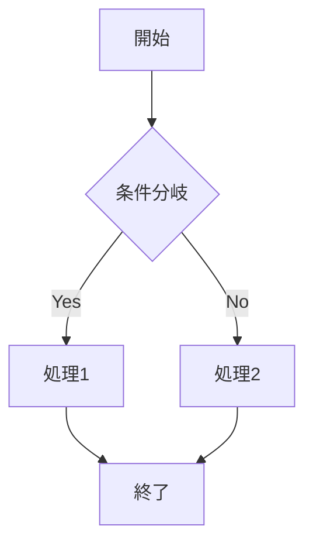
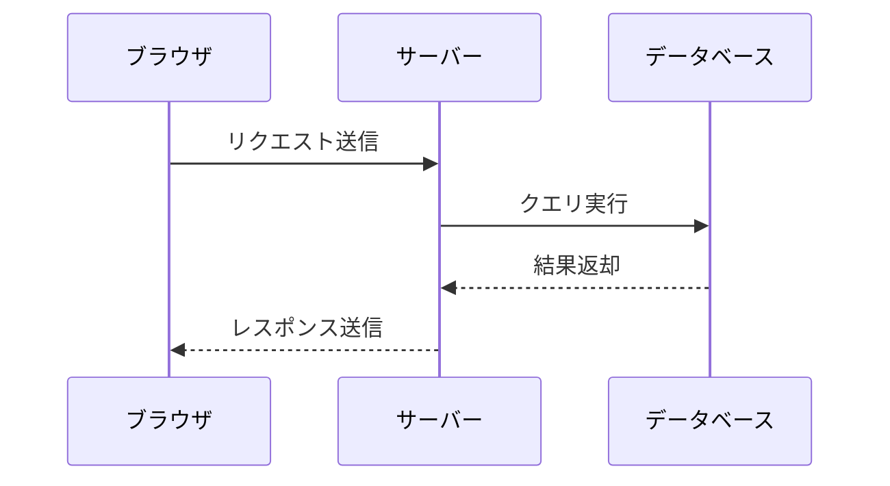
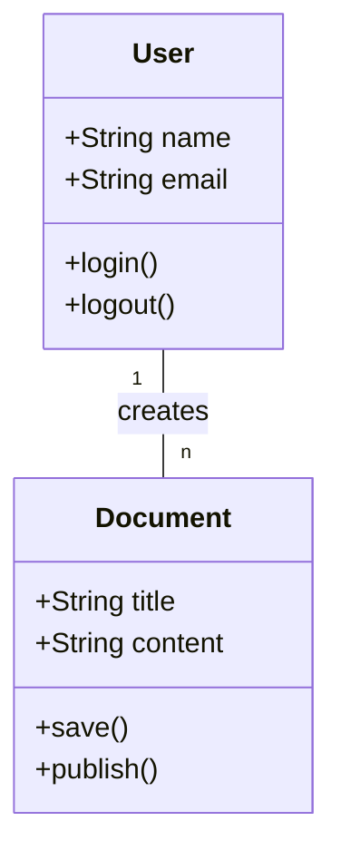
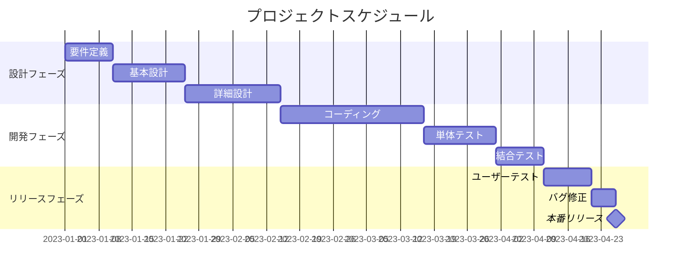
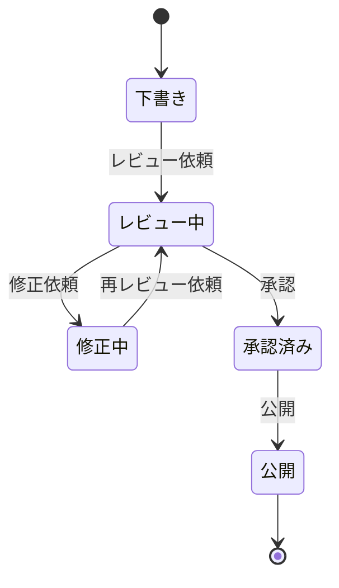
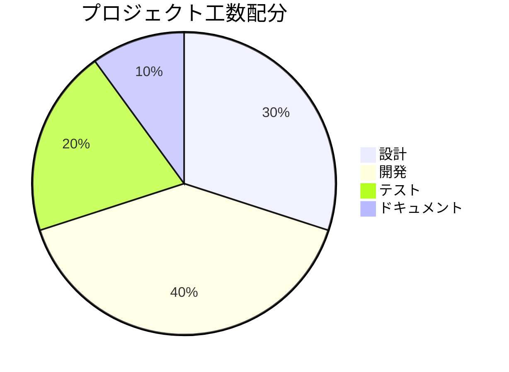
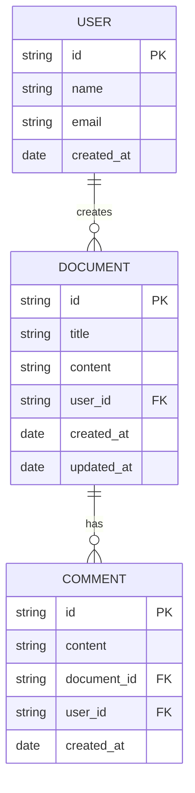

# Mermaidダイアグラムテスト

このページでは、Mermaidを使った図解の表示をテストします。

## フローチャート

```mermaid
graph TD
    A[開始] --> B{条件分岐}
    B -->|Yes| C[処理1]
    B -->|No| D[処理2]
    C --> E[終了]
    D --> E
```

## シーケンス図

```mermaid
sequenceDiagram
    participant ブラウザ
    participant サーバー
    participant データベース
    
    ブラウザ->>サーバー: リクエスト送信
    サーバー->>データベース: クエリ実行
    データベース-->>サーバー: 結果返却
    サーバー-->>ブラウザ: レスポンス送信
```

## クラス図

```mermaid
classDiagram
    class User {
        +String name
        +String email
        +login()
        +logout()
    }
    
    class Document {
        +String title
        +String content
        +save()
        +publish()
    }
    
    User "1" -- "n" Document : creates
```

## ガントチャート

```mermaid
gantt
    title プロジェクトスケジュール
    dateFormat  YYYY-MM-DD
    
    section 設計フェーズ
    要件定義           :a1, 2023-01-01, 10d
    基本設計           :a2, after a1, 15d
    詳細設計           :a3, after a2, 20d
    
    section 開発フェーズ
    コーディング       :b1, after a3, 30d
    単体テスト         :b2, after b1, 15d
    結合テスト         :b3, after b2, 10d
    
    section リリースフェーズ
    ユーザーテスト     :c1, after b3, 10d
    バグ修正           :c2, after c1, 5d
    本番リリース       :milestone, after c2, 0d
```

## 状態遷移図

```mermaid
stateDiagram-v2
    [*] --> 下書き
    下書き --> レビュー中: レビュー依頼
    レビュー中 --> 修正中: 修正依頼
    修正中 --> レビュー中: 再レビュー依頼
    レビュー中 --> 承認済み: 承認
    承認済み --> 公開: 公開
    公開 --> [*]
```

## 円グラフ

```mermaid
pie title プロジェクト工数配分
    "設計" : 30
    "開発" : 40
    "テスト" : 20
    "ドキュメント" : 10
```

## ERダイアグラム

```mermaid
erDiagram
    USER ||--o{ DOCUMENT : creates
    USER {
        string id PK
        string name
        string email
        date created_at
    }
    DOCUMENT {
        string id PK
        string title
        string content
        string user_id FK
        date created_at
        date updated_at
    }
    DOCUMENT ||--o{ COMMENT : has
    COMMENT {
        string id PK
        string content
        string document_id FK
        string user_id FK
        date created_at
    }
``` 